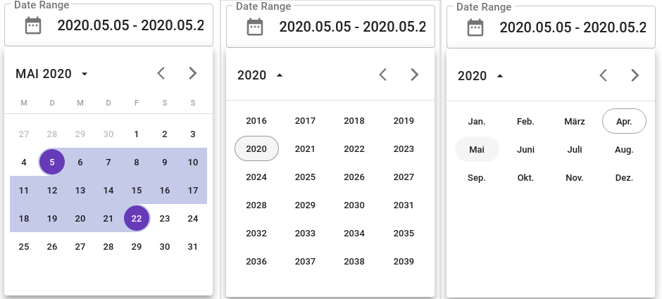

# dz-daterangepicker-material

[](https://www.npmjs.com/package/dz-daterangepicker-material) [](https://standardjs.com)

## Dz Daterangepicker [Material](https://material.io/design/introduction/).

This [React](https://reactjs.org/) date range picker component creates a dropdown menu from which a user can select a range of dates.It leverages moment.js to handle date manipulation and parsing. I created it while building my personal projects where i used [Material UI](https://material-ui.com) and  needed a way to select date ranges.

## Install

```bash
npm install --save dz-daterangepicker-material
```

## Demo

Minimal demo page is included in sample directory.

[Online demo](https://codesandbox.io/s/sad-pine-17zyi) is also available!

## Day, Year, Month view selection


## Usage

```jsx
import React from 'react'
import DateRangePicker from "dz-daterangepicker-material";

import "dz-daterangepicker-material/dist/index.css";

function Example(){
    const [date, setDate] = React.useState({
      startDate: new Date(2020, 4, 1),
      endDate: new Date(2020, 4, 10)
    })

    const onChange = (start, end) => {
        setDate({
          startDate: start,
          endDate: end,
        })
    }

    return (
     <DateRangePicker
       startDate={date.startDate}
       endDate={date.endDate}
       onChange={onChange}
       startWeek={'monday'}
       onlyView={false}
       datePicker={false}
       textFieldProps={{}}
       popoverProps={{}}
     />
    )
}
```

### Available props
|prop|description|default|type|
|--|----|--|----|
|onChange|Triggered when a date or range is selected. returns value||({start, end}) => this.setState({start, end})|
|startDate|initial start Date|null|Moment or Date|
|endDate|initial end Date|null|Moment or Date|
|startWeek|The first day of the week|"monday"|"saturday"|"sunday" |String|
|onlyView|view mode|false|Bool|
|datePicker||false|Bool|
|textFieldProps|https://material-ui.com/api/text-field|{}|Obj|
|popoverProps|https://material-ui.com/api/popover|{}|Obj|
|minDate|min date allowed in range|null|Moment or Date|
|maxDate|max date allowed in range|null|Moment or Date|
|TODO|TODO|TODO|TODO|

## Donation :beer: :beer: :beer:

[](https://www.paypal.com/cgi-bin/webscr?cmd=_s-xclick&hosted_button_id=4H8MQCF7T74P8&source=url)


## License

MIT © [Dzheyhan Ahmedov](https://github.com/dzheyhan)
